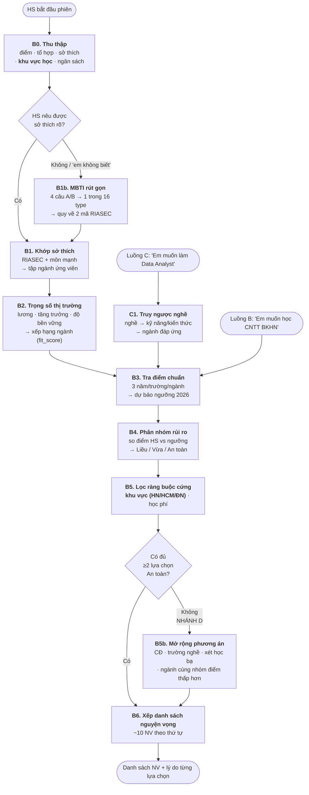

# 📄 REQUIREMENT DOCUMENT — CHATBOT ĐỊNH HƯỚNG SỰ NGHIỆP

> **Lab 03 — Chatbot vs ReAct Agent · Nhóm T029**
> **Tác giả**: Lương Thanh Trang (Role 1 — Product Architect)
> **Ngày**: 2026-07-28 · **Phiên bản**: v1.1
> **Trạng thái**: Chốt phạm vi Mốc 1 — sẵn sàng cho Role 2/3/4/5 triển khai
> **Cấp độ sản phẩm**: **MVP** — phạm vi cố tình giữ hẹp; mọi đề xuất mở rộng ghi vào §11 chứ không đưa vào bản này.

---

## 1. BỐI CẢNH & TUYÊN BỐ BÀI TOÁN

### 1.1. Người dùng mục tiêu

Học sinh lớp 12 vừa nhận kết quả thi THPT Quốc gia, đang trong thoi gian cho để đăng ký và **sắp xếp thứ tự nguyện vọng** lên hệ thống tuyển sinh.

| Thuộc tính | Mô tả |
| :--- | :--- |
| Độ tuổi | 17–18 |
| Trạng thái | Đã biết điểm thi, **chưa** biết đăng ký ngành/trường nào |
| Áp lực | Deadline cứng · quyết định ảnh hưởng 4 năm · kỳ vọng gia đình |
| Nỗi sợ chính | (1) Trượt hết nguyện vọng · (2) Đỗ vào ngành không hợp rồi bỏ giữa chừng |
| Hiểu biết | Biết điểm mình, **không** biết điểm chuẩn từng ngành, học phí, cơ hội việc làm |

### 1.2. Vấn đề

Học sinh phải ra một quyết định đa ràng buộc trong thời gian ngắn, với dữ liệu nằm rải rác ở hàng chục nguồn (đề án tuyển sinh từng trường, điểm chuẩn các năm, biểu phí, báo cáo thị trường lao động). Tư vấn hiện có hoặc **chung chung** ("chọn ngành em thích"), hoặc **chỉ tính điểm** mà bỏ qua sở thích và triển vọng nghề.

### 1.3. Tuyên bố sản phẩm

> Một AI Agent tư vấn, nhận đầu vào là **điểm thi + sở thích + tính cách + ràng buộc cá nhân**, rồi trả về **một danh sách nguyện vọng đã xếp thứ tự, chia 3 nhóm Liều / Vừa tầm / An toàn**, mỗi lựa chọn kèm bằng chứng số liệu và lý do.

### 1.4. Nguyên tắc thiết kế cốt lõi

> ### 🎯 **ƯU TIÊN SỞ THÍCH TRƯỚC — ĐIỂM SỐ CHỈ LÀ BỘ LỌC KHẢ THI**

Hệ thống **không** bắt đầu bằng câu "24.5 điểm thì đỗ được trường nào". Hệ thống bắt đầu bằng **"em hợp với ngành gì"**, rồi mới dùng điểm để lọc ra những trường khả thi trong nhóm ngành đó.

Lý do: nếu xuất phát từ điểm, học sinh sẽ chọn ngành chỉ vì "vừa đủ đỗ" — đây chính là nguyên nhân hàng đầu của bỏ học năm nhất. Ràng buộc điểm là **cần** nhưng không phải **xuất phát điểm**.

---

## 2. PHẠM VI

### 2.1. Trong phạm vi (In-scope)

| Luồng | Tên | Mô tả | Ưu tiên |
| :---: | :--- | :--- | :---: |
| **A** | Khám phá ngành | Có điểm, chưa biết chọn gì → gợi ý ngành theo sở thích → gợi ý trường | **P0** |
| **B** | Thẩm định nguyện vọng | Có điểm + có trường/ngành mơ ước → đánh giá khả năng đỗ → phương án dự phòng | **P0** |
| **C** | Truy ngược từ nghề | Có nghề mơ ước → kỹ năng/kiến thức cần có → ngành đáp ứng → trường | **P1** |
| **D** | Nhánh rẽ điểm thấp | *Không phải luồng riêng.* Kích hoạt tự động khi không tìm được lựa chọn khả thi ở bậc ĐH → chuyển hướng CĐ / trường nghề / xét học bạ | **P1** |

> **Ghi chú kiến trúc**: A và B dùng **chung một bộ tool**, chỉ khác điểm bắt đầu của vòng lặp ReAct. C thêm đúng 1 tool (`lookup_career_requirements`) rồi nhập lại vào pipeline chung tại Bước 3. D là **nhánh rẽ động** bên trong pipeline, không có tool riêng — và chính nó là bằng chứng cho tiêu chí *Dynamic Decision* trong bảng Agentic Fit.

### 2.2. Ngoài phạm vi (Out-of-scope)

- ❌ **Sinh ảnh / biểu đồ hình ảnh / infographic** — sản phẩm là **chatbot hỏi–đáp bằng văn bản thuần**. Mọi kết quả trình bày dạng text + bảng markdown.
- ❌ Đăng ký nguyện vọng thật lên hệ thống của Bộ (agent **chỉ tư vấn**, không thực hiện hành động thay người dùng)
- ❌ Trắc nghiệm hướng nghiệp đầy đủ (MBTI 93 câu / Holland bản dài) — chỉ dùng bộ rút gọn 4 câu
- ❌ Khu vực học ngoài **Hà Nội / TP.HCM / Đà Nẵng**
- ❌ Tư vấn du học, tuyển sinh riêng, xét tuyển tài năng
- ❌ Tài khoản, lưu lịch sử giữa các phiên (memory chỉ trong 1 phiên)
- ❌ Dữ liệu thời gian thực từ API bên ngoài (xem §6.1)

### 2.3. Giới hạn dữ liệu (cắt phạm vi có chủ đích)

Lab chỉ có ~240 phút. Dữ liệu **nhỏ nhưng nhất quán** quan trọng hơn dữ liệu lớn nhưng lỗ chỗ — vì dữ liệu thiếu sẽ khiến agent lặp vô hạn và mất điểm Guardrail.

| Chiều | Giới hạn | Ghi chú |
| :--- | :--- | :--- |
| Tổ hợp xét tuyển | **A00, A01, B00, C00, D01, D07** | 6 tổ hợp. Backend **tự tính** từ điểm từng môn (hàm `tinh_to_hop` §5), HS **không** tự cộng. A00 = Toán+Lý+Hoá · A01 = Toán+Lý+Anh · B00 = Toán+Hoá+Sinh · C00 = Văn+Sử+Địa · D01 = Toán+Văn+Anh · D07 = Toán+Hoá+Anh |
| **Khu vực học** | **Hà Nội · TP.HCM · Đà Nẵng** | Đúng 3 khu vực, không hỗ trợ khu vực khác |
| Số trường | **12–15** | Chia đều ~4–5 trường/khu vực để bộ lọc địa lý luôn còn kết quả |
| Số ngành | **8–10** | Chọn ngành có phổ điểm chuẩn **trải rộng** (CNTT cao ~26đ ↔ Nông nghiệp/Sư phạm thấp ~19đ) để test case phân hoá được |
| Nhóm sở thích | **6 mã Holland** (RIASEC) | Trục khớp ngành duy nhất. MBTI rút gọn chỉ là cách *khai thác* rồi quy về RIASEC (xem §3.1 B1) |
| Năm điểm chuẩn | **2023, 2024, 2025** | Đủ để tính xu hướng + độ dao động |

---

## 3. LUỒNG XỬ LÝ NGHIỆP VỤ (CORE PIPELINE)



### 3.1. Chi tiết từng bước

#### **B0 — Thu thập thông tin**

| Trường | Bắt buộc? | Giá trị hợp lệ |
| :--- | :---: | :--- |
| Điểm thi | ✅ | 0–30 |
| Tổ hợp | ✅ | A00 · A01 · D01 |
| Tín hiệu sở thích | ✅ | Mô tả tự do — **nếu HS không nêu được → chuyển B1b (MBTI)** |
| **Khu vực học mong muốn** | ⬜ *(nên hỏi)* | **Hà Nội · TP.HCM · Đà Nẵng · Không giới hạn** |
| Ngân sách học phí/năm | ⬜ | triệu đồng |
| Môn học mạnh nhất | ⬜ | Toán · Lý · Hoá · Văn · Anh |

Thiếu trường bắt buộc → hỏi lại, **không đoán**. Agent nên chủ động hỏi khu vực học ngay sau khi có điểm, vì nó cắt được ~2/3 không gian tìm kiếm.

> ⚠️ **Khu vực là bộ lọc, KHÔNG phải tiêu chí xếp hạng ngành.** Khu vực chỉ tác động ở **B5**, không đi vào `fit_score`. Sản phẩm vẫn **tư vấn ngành là chính**; địa lý chỉ thu hẹp danh sách trường sau khi đã chọn xong ngành. Khu vực là **multi-select**: HS chọn được **1, 2 hoặc cả 3** khu vực. Nếu HS không khai → mặc định "Không giới hạn", lấy cả 3 khu vực — **tuyệt đối không ngầm mặc định về Hà Nội**. Trường hợp HS chủ động chọn đủ cả 3 khu vực tương đương "Không giới hạn" và phải cho ra **cùng một kết quả**.

#### **B1 — Khớp sở thích (ưu tiên cao nhất)**
Ánh xạ sở thích/tính cách của HS sang **6 mã Holland (RIASEC)**:

| Mã | Tên | Đặc điểm | Ngành tiêu biểu |
| :---: | :--- | :--- | :--- |
| **R** | Realistic | Thích làm bằng tay, máy móc, ngoài trời | Cơ khí, Xây dựng, Điện |
| **I** | Investigative | Thích phân tích, nghiên cứu, giải đố | CNTT, Toán ứng dụng, Y |
| **A** | Artistic | Thích sáng tạo, thẩm mỹ, tự do | Thiết kế, Kiến trúc, Truyền thông |
| **S** | Social | Thích giúp đỡ, dạy, chăm sóc người | Sư phạm, Điều dưỡng, CTXH |
| **E** | Enterprising | Thích thuyết phục, lãnh đạo, kinh doanh | QTKD, Marketing, Luật |
| **C** | Conventional | Thích quy trình, số liệu, tổ chức | Kế toán, Kiểm toán, Logistics |

Mỗi ngành trong dữ liệu được gắn **2–3 mã Holland**. Điểm khớp:

```
interest_match (0–100) = (số mã trùng / số mã của ngành) × 70
                       + (điểm môn mạnh liên quan / 10) × 30
```

#### **B1b — MBTI rút gọn: khi HS không có sở thích rõ rệt**

Trường hợp rất phổ biến: *"Em không biết mình thích gì"*, *"Em học đều đều, chẳng nổi trội môn nào"*. Nếu agent ép hỏi tiếp về sở thích, HS sẽ bịa ra câu trả lời → gợi ý sai. Thay vào đó agent chuyển sang **hỏi về xu hướng hành vi** — thứ ai cũng trả lời được.

**Cơ chế**: 4 câu hỏi A/B (mỗi câu 1 chiều MBTI) → ghép thành 1 trong 16 type → **quy về 2 mã RIASEC** rồi nhập lại B1 như bình thường.

| Câu | Chiều | Lựa chọn A | Lựa chọn B |
| :---: | :---: | :--- | :--- |
| 1 | **E / I** | Em thấy thoải mái khi làm việc nhóm, trao đổi nhiều | Em thích tự làm một mình, tập trung sâu |
| 2 | **S / N** | Em thích việc cụ thể, có hướng dẫn rõ ràng | Em thích nghĩ ý tưởng mới, hình dung tương lai |
| 3 | **T / F** | Em quyết định dựa trên logic và dữ kiện | Em quyết định dựa trên cảm nhận và ảnh hưởng tới người khác |
| 4 | **J / P** | Em thích có kế hoạch, làm theo lịch | Em thích linh hoạt, tuỳ tình huống |

**Bảng quy đổi MBTI → RIASEC** (16 dòng, tra cứu cứng trong `tools.py`):

| Type | RIASEC | Type | RIASEC | Type | RIASEC | Type | RIASEC |
| :---: | :---: | :---: | :---: | :---: | :---: | :---: | :---: |
| ISTJ | C, R | ISFJ | S, C | INFJ | S, A | INTJ | I, C |
| ISTP | R, I | ISFP | A, R | INFP | A, S | INTP | I, A |
| ESTP | R, E | ESFP | A, S | ENFP | A, E | ENTP | E, I |
| ESTJ | C, E | ESFJ | S, E | ENFJ | S, E | ENTJ | E, I |

> **Vì sao quy về RIASEC thay vì khớp ngành trực tiếp bằng MBTI**: chỉ cần duy trì **một** bảng ánh xạ ngành↔RIASEC. Nếu gắn cả MBTI lên ngành thì phải bảo trì 2 bảng, dữ liệu dễ mâu thuẫn — không đáng cho MVP.
>
> **Giới hạn cần nói rõ với HS**: MBTI là công cụ **gợi mở**, không phải chẩn đoán. Câu trả lời của agent phải kèm câu kiểu *"đây là gợi ý ban đầu dựa trên xu hướng của em, em xem có thấy đúng không nhé"* → xem G-11.

#### **B2 — Trọng số thị trường việc làm & tính bền vững**
Mỗi ngành có `job_outlook_score` (1–5) tổng hợp từ 4 chỉ báo:

| Chỉ báo | Trọng số | Ý nghĩa |
| :--- | :---: | :--- |
| Tăng trưởng nhu cầu tuyển dụng 3 năm | 30% | Ngành đang mở rộng hay co lại |
| Lương khởi điểm trung bình | 25% | Hồi vốn học phí |
| Rủi ro bị tự động hoá / AI thay thế | 25% | **Tính bền vững** — chỉ báo quan trọng nhất với HS 18 tuổi vì các em còn ~40 năm đi làm |
| Độ rộng ngành (khả năng chuyển nghề) | 20% | Học xong có bị khoá cứng vào 1 nghề không |

Nhãn hiển thị: `Bền vững cao (4.0–5.0)` · `Ổn định (2.5–3.9)` · `Cần thận trọng (1.0–2.4)`

**Điểm phù hợp tổng của ngành:**

```
fit_score = 0.45 × interest_match_norm      (sở thích — trọng số cao nhất)
          + 0.30 × job_outlook_norm          (thị trường & bền vững)
          + 0.25 × academic_fit_norm         (năng lực học thuật theo môn thành phần)
```

> Trọng số 0.45 cho sở thích là hiện thực hoá trực tiếp nguyên tắc §1.4. Khi bị cross-audit hỏi "vì sao không ưu tiên lương cao nhất", đây là câu trả lời.

#### **B3 — Tra & dự báo điểm chuẩn**

⚠️ **Làm rõ**: Học sinh **đã có điểm rồi**, không cần dự báo điểm thí sinh. Thứ cần dự báo là **điểm chuẩn năm 2026 của từng ngành/trường**.

Công thức dự báo (trung bình có trọng số, nghiêng về năm gần nhất):

```
P̂₂₀₂₆ = 0.5 × S₂₀₂₅ + 0.3 × S₂₀₂₄ + 0.2 × S₂₀₂₃
σ      = độ lệch chuẩn của (S₂₀₂₃, S₂₀₂₄, S₂₀₂₅)
b      = max(0.5, σ)        ← biên dao động, tối thiểu 0.5 điểm
```

`b` tự động **nới rộng** với những ngành có điểm chuẩn biến động mạnh giữa các năm, và **thắt chặt** với ngành ổn định. Đây là cách mã hoá độ bất định vào kết quả thay vì đưa ra một con số giả vờ chính xác.

#### **B4 — Phân nhóm rủi ro Liều / Vừa tầm / An toàn**

```
Δ = điểm_thí_sinh − P̂₂₀₂₆
```

| Nhóm | Điều kiện | Ý nghĩa với HS |
| :---: | :--- | :--- |
| 🟢 **An toàn** | `Δ ≥ +b` | Gần như chắc chắn đỗ — đây là lưới an toàn |
| 🟡 **Vừa tầm** | `−b ≤ Δ < +b` | Cân bằng, khả năng đỗ trung bình |
| 🔴 **Liều** | `−2b ≤ Δ < −b` | Cần may mắn, chỉ nên đặt ở NV đầu |
| ⚫ **Ngoài tầm** | `Δ < −2b` | **Không** đưa vào danh sách chính; chỉ nêu để tham khảo |

**Ví dụ 1 — ngành ổn định:** CNTT, ĐH Bách Khoa HN. Điểm chuẩn 25.6 / 26.0 / 26.3
→ `P̂ = 0.5(26.3) + 0.3(26.0) + 0.2(25.6) = 26.07` · `σ = 0.29` → `b = 0.5`
→ HS 24.5 điểm: `Δ = −1.57 < −2b (−1.0)` → ⚫ **Ngoài tầm**

**Ví dụ 2 — ngành biến động:** Sư phạm Toán, ĐH Vinh. Điểm chuẩn 22.0 / 24.5 / 23.0
→ `P̂ = 23.25` · `σ = 1.03` → `b = 1.03` (biên **tự nới rộng** do dao động lớn)
→ HS 24.5 điểm: `Δ = +1.25 ≥ +b` → 🟢 **An toàn**

#### **B5 — Lọc ràng buộc cứng**
Loại thẳng khỏi danh sách (không xếp hạng lại):
- `học_phí_năm > ngân_sách_HS` (nếu HS khai)
- `khu_vực ∉` tập khu vực HS đã chọn — tập này là **tập con bất kỳ** của {Hà Nội, TP.HCM, Đà Nẵng}, gồm 1, 2 hoặc cả 3 phần tử (không khai → lấy cả 3)

#### **B5b — NHÁNH D: mở rộng phương án khi điểm thấp**
Kích hoạt **tự động** khi sau B5 không còn ≥2 lựa chọn nhóm 🟢 An toàn. Agent tự chuyển hướng, **không hỏi lại người dùng** — đây là hành vi Dynamic Decision cần chứng minh. Thứ tự nới lỏng:
1. Nới sang ngành cùng nhóm Holland nhưng ngưỡng điểm thấp hơn
2. **Nới khu vực** sang 2 khu vực còn lại trong 3 khu vực hỗ trợ *(phải nói rõ với HS là đã nới, kèm lý do)*
3. Đề xuất bậc **Cao đẳng / trường nghề** cùng lĩnh vực (kèm lộ trình liên thông ĐH)
4. Gợi ý phương thức xét tuyển khác (học bạ, đánh giá năng lực)

#### **B6 — Xếp danh sách nguyện vọng**
Cấu trúc khuyến nghị **~10 nguyện vọng**:

| Vị trí | Nhóm | Số lượng |
| :---: | :---: | :---: |
| NV 1–3 | 🔴 Liều | 3 |
| NV 4–7 | 🟡 Vừa tầm | 4 |
| NV 8–10 | 🟢 An toàn | 3 |

**Quy tắc chặn (product guardrail)**: danh sách **không được** trả về nếu có `< 2` nguyện vọng nhóm 🟢. Trường hợp đó bắt buộc quay lại B5b.

---

## 4. YÊU CẦU CHỨC NĂNG (FUNCTIONAL REQUIREMENTS)

| ID | Yêu cầu | Ưu tiên | Luồng |
| :--- | :--- | :---: | :---: |
| **FR-01** | Thu thập & xác thực điểm thi (0–30), tổ hợp xét tuyển hợp lệ | P0 | A,B,C |
| **FR-02** | Thu thập tín hiệu sở thích/tính cách, ánh xạ sang mã RIASEC | P0 | A |
| **FR-02b** | **Khi HS không nêu được sở thích** → hỏi 4 câu MBTI rút gọn → quy ra RIASEC → tiếp tục pipeline bình thường | **P0** | A |
| **FR-02c** | **Hỏi khu vực học mong muốn** (Hà Nội / TP.HCM / Đà Nẵng / Không giới hạn); không khai → mặc định cả 3 | **P0** | A,B,C |
| **FR-03** | Gợi ý danh sách ngành phù hợp, xếp hạng theo `fit_score`, **giải thích lý do từng ngành** | P0 | A |
| **FR-04** | Tra cứu điểm chuẩn 3 năm gần nhất theo (trường, ngành, tổ hợp) | P0 | A,B,C |
| **FR-05** | Dự báo ngưỡng điểm 2026 theo công thức §B3, luôn trả kèm biên `b` | P0 | A,B,C |
| **FR-06** | Phân nhóm Liều / Vừa tầm / An toàn theo §B4 | P0 | A,B |
| **FR-07** | Lọc theo học phí tối đa và khu vực địa lý (3 khu vực) — **là bộ lọc, không tham gia xếp hạng ngành** | P0 | A,B |
| **FR-08** | Cung cấp thống kê thị trường việc làm & điểm bền vững theo ngành | P0 | A,B,C |
| **FR-09** | Xuất danh sách ~10 nguyện vọng đã xếp thứ tự, đảm bảo ≥2 lựa chọn An toàn | P0 | A,B |
| **FR-10** | Truy ngược nghề → kỹ năng/kiến thức → ngành đáp ứng | P1 | C |
| **FR-11** | Tự động kích hoạt nhánh nới khu vực → CĐ/nghề/học bạ khi thiếu lựa chọn An toàn | P1 | D |
| **FR-12** | Giữ ngữ cảnh trong 1 phiên (điểm, sở thích, khu vực, ngân sách) qua nhiều lượt hỏi | P2 | Tất cả |
| **FR-13** | Toàn bộ đầu ra là **văn bản + bảng markdown**, không sinh ảnh/biểu đồ | P0 | Tất cả |

>  **cắt khỏi MVP**. Học phí đã có sẵn trong output của `filter_universities`, không cần tool riêng.

---

## 5. ĐẶC TẢ CÔNG CỤ (TOOL SPECS — bàn giao Role 2)

Tất cả tool là **read-only, deterministic**, trả về **JSON/chuỗi text** (không tool nào sinh ảnh). Lỗi nghiệp vụ trả về **chuỗi thông báo**, tuyệt đối không `raise` exception làm crash agent loop.

**Tổng cộng 6 tool** cho MVP: `T0` MBTI · `T1` gợi ý ngành · `T2` điểm chuẩn · `T3` lọc trường · `T4` thị trường việc làm · `T5` truy ngược nghề.

### B0′. `tinh_to_hop` — **hàm backend, KHÔNG phải tool**
| Field | Nội dung |
| :--- | :--- |
| **Purpose** | Chạy **TRƯỚC** vòng ReAct, ngay sau khi HS nhập điểm từng môn. HS **không** tự cộng điểm tổ hợp, agent **không** hỏi "em xét khối nào". |
| **Input** | `diem_mon: dict` — key ∈ `{toan, ly, hoa, sinh, van, su, dia, anh}`, chỉ cần các môn đã thi |
| **Output** | `{to_hop_kha_dung: dict, to_hop_toi_uu: str, diem_xet_tuyen: float}` — chỉ tính những tổ hợp có **đủ 3 môn**; `to_hop_toi_uu` là tổ hợp cho điểm **cao nhất** |
| **Error** | Môn ngoài `[0, 10]` **hoặc** tổ hợp ngoài `[0, 30]` → trả **chuỗi** `"LỖI: Điểm mỗi môn phải trong khoảng 0–10 (nhận được: ...) và điểm tổ hợp phải trong khoảng 0–30 (nhận được: ...)."` — không `raise` (G-13) |
| **Lưu ý trace** | **KHÔNG tính là tool call.** Agent dùng `to_hop_toi_uu` và **nói rõ** đã chọn tổ hợp nào, không được lấy tổ hợp bất lợi hơn. |

### T0. `mbti_quick_assess` — *dùng khi HS không có sở thích rõ*
| Field | Nội dung |
| :--- | :--- |
| **Purpose** | Bước B1b. Chỉ gọi khi HS trả lời kiểu "em không biết mình thích gì / không nổi trội môn nào". **Không** gọi nếu HS đã nêu được sở thích. |
| **Input** | `tra_loi: str` — chuỗi 4 ký tự A/B theo thứ tự 4 câu, ví dụ `"BABA"` |
| **Output** | JSON: `{mbti_type, mo_ta_ngan, ma_holland: ["I","C"], luu_y}` |
| **Error** | Chuỗi không đúng 4 ký tự A/B → `"LỖI: Cần đúng 4 lựa chọn A hoặc B theo thứ tự 4 câu. Nhận được: '<x>'."` |
| **Side effect** | Read-only |

### T1. `find_majors_by_interest`
| Field | Nội dung |
| :--- | :--- |
| **Purpose** | Bước B1 — tìm ngành theo sở thích. Dùng khi HS chưa biết chọn ngành. Không dùng khi HS đã nêu rõ ngành. |
| **Input** | `so_thich: str` (mô tả tự do hoặc mã RIASEC), `mon_manh: str = ""` |
| **Output** | JSON list: `[{ma_nganh, ten_nganh, ma_holland, interest_match, ly_do}]`, tối đa 5 ngành |
| **Error** | Không nhận diện được sở thích → `"LỖI: Chưa đủ thông tin sở thích. Gợi ý hỏi HS: em thích làm việc với con người, con số, hay máy móc?"` |

### T2. `lookup_admission_scores`
| Field | Nội dung |
| :--- | :--- |
| **Purpose** | Bước B3 — tra điểm chuẩn 3 năm + chỉ tiêu. Nguồn sự thật duy nhất về điểm chuẩn. |
| **Input** | `ten_truong: str`, `ten_nganh: str`, `to_hop: str` |
| **Output** | JSON: `{truong, nganh, to_hop, diem_2023, diem_2024, diem_2025, chi_tieu_2025, du_bao_2026, bien_dao_dong_b}` |
| **Error** | Không có trong dữ liệu → `"LỖI: Chưa có dữ liệu điểm chuẩn cho <ngành> tại <trường> với tổ hợp <tổ hợp>. Các trường hiện có: [...]"` |

### T3. `filter_universities` — *tool xương sống*
| Field | Nội dung |
| :--- | :--- |
| **Purpose** | Bước B4+B5 — lọc đa điều kiện và phân nhóm rủi ro. Tool được gọi nhiều nhất. |
| **Input** | `ma_nganh: str`, `diem_thi: float`, `to_hop: str`, `hoc_phi_max: int = 0` (0 = không giới hạn), `khu_vuc: List[str] = []` |
| **Tham số `khu_vuc`** | **MULTI-SELECT.** Mỗi phần tử chỉ nhận `"Hà Nội"` \| `"TP.HCM"` \| `"Đà Nẵng"`; HS chọn được **1, 2 hoặc cả 3**. Mảng rỗng `[]` ≡ đủ 3 phần tử ≡ **không giới hạn** — hai cách này **phải cho ra cùng kết quả**. Lọc bằng phép kiểm tra thành viên trên cả list, ⚠️ **không** được lấy `khu_vuc[0]`. Chuẩn hoá alias **trước** khi kiểm enum: `"Sài Gòn"/"Saigon"/"TPHCM"/"TP HCM"/"Hồ Chí Minh"/"HCM"` → `"TP.HCM"` · `"Ha Noi"/"HN"` → `"Hà Nội"` · `"Da Nang"/"ĐN"` → `"Đà Nẵng"` |
| **Output** | JSON list: `[{truong, nganh, du_bao_2026, delta, nhom_rui_ro, hoc_phi_nam, khu_vuc}]` đã sắp xếp theo `delta` giảm dần |
| **Error** | `diem_thi` ngoài [0, 30] → `"LỖI: Điểm thi phải trong khoảng 0–30. Giá trị nhận được: <x>."` · phần tử trong `khu_vuc` vẫn ngoài enum **sau khi đã chuẩn hoá alias** → `"LỖI: Hệ thống hiện chỉ hỗ trợ Hà Nội, TP.HCM, Đà Nẵng. Nhận được: '<x>'."` — agent phải từ chối **riêng phần tử sai** và **vẫn lọc theo các khu vực hợp lệ còn lại** trong cùng lượt, không huỷ cả yêu cầu · Không có kết quả sau lọc → `"KHÔNG CÓ KẾT QUẢ: không trường nào thoả điều kiện. Gợi ý nới lỏng: học phí hoặc khu vực."` |

### T4. `get_job_market_stats`
| Field | Nội dung |
| :--- | :--- |
| **Purpose** | Bước B2 — thống kê thị trường việc làm & tính bền vững của ngành |
| **Input** | `ma_nganh: str` |
| **Output** | JSON: `{nganh, luong_khoi_diem_trieu, ty_le_co_viec_6thang, tang_truong_tuyen_dung_3nam, rui_ro_tu_dong_hoa, job_outlook_score, nhan_ben_vung}` |
| **Error** | `"LỖI: Chưa có dữ liệu thị trường cho ngành '<x>'. Các ngành hiện có: [...]"` |

### T5. `lookup_career_requirements` — *luồng C*
| Field | Nội dung |
| :--- | :--- |
| **Purpose** | Truy ngược: nghề mơ ước → kỹ năng/kiến thức cần có → ngành học đáp ứng |
| **Input** | `ten_nghe: str` |
| **Output** | JSON: `{nghe, ky_nang_cot_loi: [], kien_thuc_nen_tang: [], nganh_dap_ung: [{ma_nganh, do_phu_hop, ghi_chu}]}` |
| **Error** | `"LỖI: Chưa có dữ liệu cho nghề '<x>'. Các nghề hiện hỗ trợ: [...]"` |

> 🗑️ **Đã cắt khỏi MVP**: `get_program_detail` (chi tiết chương trình đào tạo). Học phí — trường duy nhất HS thực sự cần — đã nằm trong output của `filter_universities`. Thêm tool này chỉ làm dài trace mà không đổi quyết định của HS.

---

## 6. YÊU CẦU DỮ LIỆU

### 6.1. Nguồn dữ liệu

**Quyết định**: dùng **dữ liệu mock deterministic nhúng trong `src/tools.py`**, hiệu chỉnh theo dải thực tế (điểm chuẩn 18–28, học phí 12–60 triệu/năm, lương khởi điểm 8–20 triệu).

Lý do: (1) codelab yêu cầu phần lớn bài chạy deterministic; (2) không phụ thuộc mạng/API key khi demo; (3) kiểm soát được edge case để test guardrail. Con số bám dải thực tế nên vẫn thuyết phục khi trình bày.

### 6.2. Lược đồ dữ liệu

```python
MAJORS = {
  "CNTT": {
    "ten": "Công nghệ thông tin",
    "holland": ["I", "R"],
    "mon_lien_quan": ["Toán", "Lý"],
    "job_outlook_score": 4.6,
    "nhan_ben_vung": "Bền vững cao"
  }, ...
}

ADMISSION = {
  ("BKHN", "CNTT", "A00"): {
    "diem": [25.6, 26.0, 26.3],   # 2023, 2024, 2025
    "chi_tieu_2025": 680
  }, ...
}

KHU_VUC = ["Hà Nội", "TP.HCM", "Đà Nẵng"]     # đóng, không mở rộng trong MVP

UNIVERSITIES = {
  "BKHN":  {"ten_day_du": "ĐH Bách Khoa Hà Nội",  "khu_vuc": "Hà Nội",  "hoc_phi_nam_trieu": 35},
  "BKDN":  {"ten_day_du": "ĐH Bách Khoa Đà Nẵng", "khu_vuc": "Đà Nẵng", "hoc_phi_nam_trieu": 22},
  "BKHCM": {"ten_day_du": "ĐH Bách Khoa TP.HCM",  "khu_vuc": "TP.HCM",  "hoc_phi_nam_trieu": 30}, ...
}

MBTI_TO_HOLLAND = {          # 16 dòng, bảng tra cứng — xem §3.1 B1b
  "ISTJ": ["C", "R"], "ISFJ": ["S", "C"], "INFJ": ["S", "A"], "INTJ": ["I", "C"],
  "ISTP": ["R", "I"], "ISFP": ["A", "R"], "INFP": ["A", "S"], "INTP": ["I", "A"],
  "ESTP": ["R", "E"], "ESFP": ["A", "S"], "ENFP": ["A", "E"], "ENTP": ["E", "I"],
  "ESTJ": ["C", "E"], "ESFJ": ["S", "E"], "ENFJ": ["S", "E"], "ENTJ": ["E", "I"],
}

CAREERS = {
  "data analyst": {
    "ky_nang_cot_loi": ["SQL", "Thống kê", "Trực quan hoá dữ liệu", "Tư duy phản biện"],
    "kien_thuc_nen_tang": ["Xác suất thống kê", "Cơ sở dữ liệu"],
    "nganh_dap_ung": [("CNTT", 0.9), ("TOAN_UD", 0.85), ("KTOAN", 0.55)]
  }, ...
}
```

### 6.3. Yêu cầu phủ dữ liệu
- Mỗi ngành có **≥3 trường** ở các mức điểm chuẩn khác nhau (để phân nhóm rủi ro có ý nghĩa)
- **Mỗi khu vực (HN / HCM / ĐN) có ≥4 trường**, và **≥1 ngành xuất hiện ở cả 3 khu vực** — để test case lọc địa lý luôn có kết quả để so sánh
- **Đà Nẵng** cần có ít nhất 2 trường điểm chuẩn thấp (< 21) → làm chỗ hạ cánh cho bước "nới khu vực" của nhánh D
- **≥2 ngành** có điểm chuẩn biến động mạnh (σ > 1.0) để chứng minh cơ chế biên `b` động
- **≥3 ngành** có ngưỡng dưới 20 điểm để nhánh D có chỗ hạ cánh
- **≥5 nghề** trong `CAREERS` cho luồng C
- Đủ **16 dòng** trong `MBTI_TO_HOLLAND` (không thiếu type nào, tránh KeyError)

---

## 7. GUARDRAILS & YÊU CẦU PHI CHỨC NĂNG (bàn giao Role 3)

Đề tài này đụng tới **quyết định lớn của trẻ vị thành niên** — guardrail không chỉ là vấn đề kỹ thuật.

| ID | Rủi ro | Biện pháp | Loại |
| :--- | :--- | :--- | :---: |
| **G-01** | Bot khẳng định "em **chắc chắn đỗ**" | Cấm ngôn ngữ chắc chắn trong system prompt. Luôn diễn đạt dạng khoảng + nhóm rủi ro. | Đạo đức |
| **G-02** | Bịa điểm chuẩn khi tool lỗi/thiếu dữ liệu | Bắt buộc trích dẫn Observation. Không có dữ liệu → nói "chưa có dữ liệu", **không suy đoán**. | Grounding |
| **G-03** | Giọng điệu phán xét khi điểm thấp | Quy tắc tone: không dùng từ tiêu cực ("kém", "trượt chắc"). Mọi phản hồi kèm **≥1 lối đi khả thi**. | Đạo đức |
| **G-04** | Bot quyết định thay học sinh | Bot đưa **phương án + lý do**; câu chốt luôn nhắc quyết định cuối thuộc về HS và gia đình. | Đạo đức |
| **G-05** | Vòng lặp vô hạn | `MAX_ITERATIONS = 8`. Chạm ngưỡng → fallback lịch sự kèm phần kết quả đã thu được. | Kỹ thuật |
| **G-06** | Gọi tool không tồn tại | Trả về `"Tool không tồn tại. Các tool hợp lệ: [...]"` để agent tự sửa. | Kỹ thuật |
| **G-07** | Đầu vào vô lý (điểm 45/30, tổ hợp không có) | Tool validate range → trả lỗi mô tả → agent **hỏi lại người dùng**, không lặp lại tool. | Kỹ thuật |
| **G-08** | Lặp lại cùng tool + cùng tham số | Phát hiện action trùng → chèn cảnh báo vào Observation, ép agent đổi hướng. | Kỹ thuật |
| **G-09** | Rò rỉ PII (tên thật, SBD, CCCD của HS) | Không lưu, không log định danh cá nhân. `.env` và log không commit. | Riêng tư |
| **G-10** | Trả danh sách không có lưới an toàn | Chặn ở tầng sản phẩm: `< 2` lựa chọn 🟢 → bắt buộc chạy nhánh B5b. | Sản phẩm |

**Phi chức năng khác**: phản hồi ≤ 30s/lượt · toàn bộ giao tiếp bằng tiếng Việt, giọng thân thiện phù hợp HS 18 tuổi · mọi con số hiển thị phải truy được về một Observation cụ thể.

---

## 8. ĐÁNH GIÁ AGENTIC FIT (bàn giao Role 5)

| Tiêu chí | Điểm | Lập luận bảo vệ khi bị phản biện |
| :--- | :---: | :--- |
| 🧠 **Multi-step Reasoning** | **5/5** | Pipeline 6 bước bắt buộc: sở thích → xếp hạng ngành → tra điểm chuẩn → phân nhóm rủi ro → lọc ràng buộc → xếp nguyện vọng. Không bước nào bỏ được mà vẫn ra kết quả đúng. |
| 🛠️ **Tool Interaction** | **5/5** | Điểm chuẩn, chỉ tiêu, học phí, thống kê việc làm đều là **dữ liệu tra cứu**. LLM thuần bịa 100% — đây là bằng chứng trực tiếp cho phần so sánh Chatbot vs Agent. |
| 🔀 **Dynamic Decision** | **5/5** | Kết quả bước trước **đổi hẳn** hành động bước sau: điểm dưới ngưỡng mọi trường → agent tự kích hoạt nhánh D (CĐ/nghề/học bạ) mà không hỏi lại người dùng. Đây là điểm khác biệt so với bài toán mẫu chỉ chạy tuần tự. |
| ⏳ **Long Horizon** | **4/5** | Một phiên đầy đủ ~5–7 lượt gọi tool, mang state (điểm, sở thích, ràng buộc) xuyên suốt nhiều lượt hội thoại. |
| **TỔNG** | **19/20** | **KẾT LUẬN: BÀI TOÁN BẮT BUỘC DÙNG REACT AGENT.** |

---

## 9. ĐỊNH HƯỚNG BỘ TEST CASE (bàn giao — Role 1 tự triển khai)

> ✅ **ĐÃ TRIỂN KHAI.** Bộ test case chính thức nằm ở **`config/test_cases.json`** — **19 case** (TC01–TC18, trong đó TC05 tách thành TC05a/TC05b), phủ đủ cả 6 tool và 3 loại case Normal / Abnormal / Boundary.
>
> Bảng dưới là bản **phác thảo ban đầu**, giữ lại để đối chiếu lịch sử. Khi hai bên lệch nhau thì **`test_cases.json` là nguồn đúng**.

| # | Loại | Nội dung dự kiến | Kỳ vọng ở Agent | Tool path |
| :---: | :--- | :--- | :--- | :--- |
| **1** | 🟢 Đơn giản | "Ngành Công nghệ thông tin học những gì?" | Trả lời ngay bằng kiến thức nền, **0 tool call** | — |
| **2** | 🟢 Đơn giản | "Nguyện vọng 1 và nguyện vọng 2 khác nhau thế nào?" | Giải thích quy chế, **0 tool call** | — |
| **3** | 🟡 1 Tool | "Em được 24.5 khối A00, ngành CNTT ĐH Bách Khoa HN lấy bao nhiêu?" | Gọi `lookup_admission_scores` → trả điểm 3 năm + dự báo + nhóm rủi ro | T2 |
| **4** | 🟡 Multi-tool + **MBTI** + **khu vực** | *(nhiều lượt)* "**Em không biết mình thích gì cả.** Em được 22 điểm A01, **muốn học ở Đà Nẵng**." → agent hỏi 4 câu → HS đáp `"BABA"` | `mbti_quick_assess` → `find_majors_by_interest` → `filter_universities(khu_vuc=["Đà Nẵng"])` → danh sách NV | T0 → T1 → T3 |
| **5** | 🔴 Edge case | "Em thi được 45 điểm khối A00, tư vấn giúp em." | Tool validate → báo lỗi range → agent **hỏi lại người dùng**, dừng đúng lúc, **không lặp** | T3 (lỗi) |
| **6** | 🟠 *Bổ sung* — **nhánh D** | "Em 16.5 điểm A00, thích máy móc, muốn học ở Hà Nội, học phí dưới 20 triệu." | `find_majors_by_interest` → `filter_universities` → **không đủ lựa chọn An toàn** → agent **tự** nới khu vực rồi chuyển hướng CĐ/nghề, không hỏi lại HS | T1 → T3 → T3 (lần 2, khu vực đã nới) |

> **Case #4** chứng minh MBTI fallback + bộ lọc khu vực + multi-tool. **Case #6** chứng minh *Dynamic Decision* — đây là case ăn điểm Agentic Fit cao nhất, nên tách riêng thay vì nhồi chung vào #4 cho trace dễ đọc.
>
> Case #6 là **bổ sung ngoài 5 case bắt buộc** của rubric. Nếu thiếu thời gian, ưu tiên hoàn thành #1–#5 trước.

---

## 10. TIÊU CHÍ NGHIỆM THU (DEFINITION OF DONE)

- [ ] Agent chạy đủ 5 test case bắt buộc, không crash
- [ ] Case #3, #4 có Observation thật từ tool; mọi con số trong câu trả lời truy được về Observation
- [ ] Case #4: HS nói "không biết thích gì" → agent **tự chuyển sang hỏi MBTI**, không hỏi lại về sở thích
- [ ] Case #4: kết quả chỉ chứa trường ở **Đà Nẵng**, không lẫn trường HN/HCM
- [ ] Case #5 dừng an toàn bằng guardrail, không lặp vô hạn
- [ ] *(Nếu làm #6)* Nhánh D kích hoạt **tự động**, không cần người dùng gợi ý
- [ ] Chatbot baseline trả lời case #3/#4 bằng thông tin **bịa** → có bằng chứng đối chứng trong `trace_eval.md`
- [ ] Danh sách nguyện vọng luôn có ≥2 lựa chọn nhóm 🟢 An toàn
- [ ] Không có câu trả lời nào chứa từ ngữ khẳng định chắc chắn đỗ/trượt
- [ ] Không có câu trả lời nào dán nhãn tính cách cứng nhắc từ MBTI (G-11)
- [ ] Toàn bộ đầu ra là văn bản/bảng, **không có ảnh hay biểu đồ hình ảnh**

---

## 11. VẤN ĐỀ CÒN MỞ

| # | Vấn đề | Đề xuất | Người chốt |
| :---: | :--- | :--- | :--- |
| 1 | Có thay dữ liệu mock bằng điểm chuẩn thật của trường VN không? | Giữ mock cho Mốc 1–3; nếu dư thời gian ở Mốc 4 thì hiệu chỉnh lại bằng số thật để demo thuyết phục hơn | Cả nhóm |
| 2 | Trọng số `fit_score` (0.45 / 0.30 / 0.25) đã hợp lý chưa? | Giữ nguyên cho v1; ghi nhận là tham số có thể tinh chỉnh | Role 1 |
| 3 | Có làm Bonus Memory (Cấp 4) không? | FR-12 (giữ ngữ cảnh trong phiên) đã là bước đệm — chỉ cần mở rộng nhẹ là ăn được +10% | Role 4 |
| 4 | `MAX_ITERATIONS = 8` có đủ không? Case #4 cần 3 tool + hỏi lại, case #6 cần 4 tool | Theo dõi ở Mốc 3, nâng lên 10 nếu trace bị cắt sớm | Role 3 |
| 5 | 4 câu MBTI có đủ tin cậy không? | Đủ cho MVP — mục tiêu là **khai thác tín hiệu**, không phải chẩn đoán chính xác. Kết quả luôn kèm câu xác nhận lại với HS (G-11) | Role 1 |

---

### 📌 Ghi chú phiên bản v1.1 (thay đổi so với v1.0)

| Thêm | Cắt |
| :--- | :--- |
| ➕ Khu vực học: 3 lựa chọn HN / TP.HCM / Đà Nẵng (§2.3, §3.1 B0+B5, FR-02c, T3) | ➖ Tool `get_program_detail` + FR chi tiết chương trình đào tạo |
| ➕ MBTI rút gọn 4 câu khi HS không có sở thích rõ (§3.1 B1b, FR-02b, tool T0) | ➖ Khu vực ngoài 3 thành phố lớn |
| ➕ Ràng buộc text-only, không sinh ảnh (§2.2, FR-13) | |
| ➕ G-11 → G-13 (guardrail MBTI & khu vực) · Test case #6 cho nhánh D | |

**Cân đối MVP**: thêm 1 tool (T0 MBTI), cắt 1 tool (`get_program_detail`) → **vẫn giữ 6 tool** như v1.0, khối lượng cho Role 2 không đổi.

---

## 12. BÀN GIAO

| Nhận | File | Nội dung lấy từ |
| :--- | :--- | :--- |
| **Role 2** — Tool Engineer | `src/tools.py` | §5 (Tool Specs) + §6 (Lược đồ dữ liệu) |
| **Role 3** — Prompt Engineer | `src/prompts.py` | §7 (Guardrails) + §3 (Pipeline để viết ReAct prompt) |
| **Role 4** — Integrator | `src/app.py` | §3 (Luồng) + §7 G-05..G-08 |
| **Role 5** — Observability | `docs/trace_eval.md` | §8 (Agentic Fit) + §10 (Nghiệm thu) |
| **Role 1** — Product Architect | `config/test_cases.json` | §9 (Định hướng test case) |