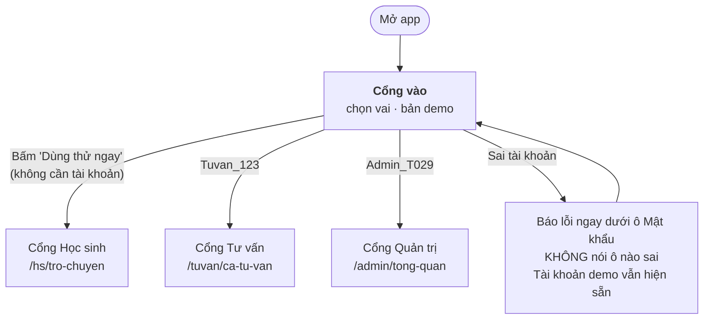
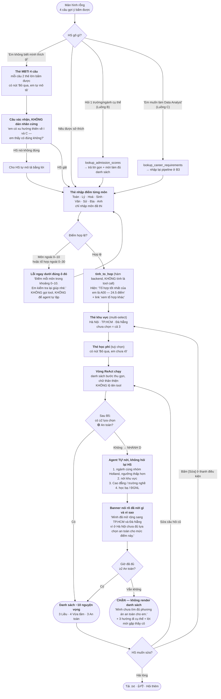
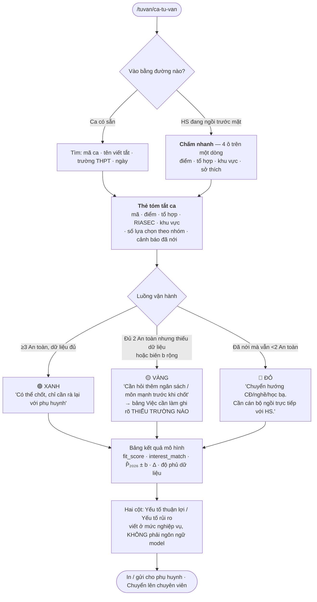
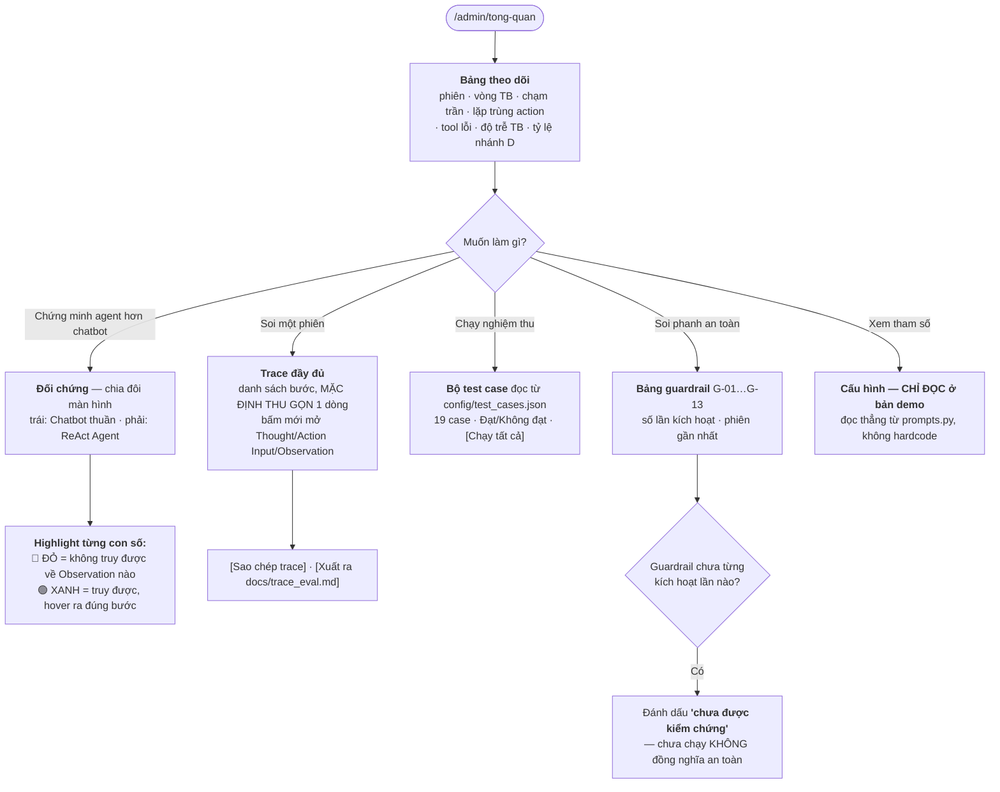

# 🧭 USER FLOW — LA BÀN NGUYỆN VỌNG

> **Bàn giao 1/4** (theo `docs/PROMPT_THIET_KE_UI_UX.md` §9.1)
> Nguồn sự thật: `docs/REQUIREMENTS.md` v1.1 · `config/test_cases.json`
> Ngày: 2026-07-28 · Trạng thái code khi thiết kế: `src/` **vẫn là khung mẫu của lab** (weather/flights), chưa có code sản phẩm.

Đọc kèm: [UI_WIREFRAME.md](UI_WIREFRAME.md) · [UI_SPEC.md](UI_SPEC.md) · [prototype/la-ban-nguyen-vong.html](prototype/la-ban-nguyen-vong.html)

---

## 0. Chốt việc cần làm trước khi vẽ

### Ba vai, ba việc khác nhau

| | **Học sinh / Phụ huynh** | **Cán bộ tư vấn** | **Quản trị & Kiểm định** |
| :--- | :--- | :--- | :--- |
| **Ai** | HS lớp 12, 17–18 tuổi, vừa biết điểm | Giáo viên hướng nghiệp, 30–50 ca/buổi mùa cao điểm | Đội dev T029 + người chấm chéo |
| **Trạng thái khi tới** | Vội, lo, deadline cứng, **không biết bắt đầu từ đâu** | Vội, lặp lại, cần lý do để bảo vệ lời khuyên trước phụ huynh | Bình tĩnh, hoài nghi, đang đi tìm bằng chứng agent **bịa hay không** |
| **Một việc phải trơn** | Từ "em không biết gì cả" → **danh sách 10 NV xếp thứ tự, có ≥2 lựa chọn An toàn** | Từ 4 trường nhập nhanh → **thẻ ca có lý do đủ vững**, dưới 3 phút | Từ một câu hỏi → **trace đầy đủ, mỗi con số truy về được 1 Observation** |
| **Câu hỏi lọc** | *HS lần đầu, không đọc hướng dẫn, có ra được danh sách không?* | *Cán bộ có bảo vệ được lời khuyên trước phụ huynh khó tính không?* | *Người chấm chéo có tự tìm được chỗ agent bịa mà không cần ta giải thích không?* |

### Thứ tự dựng — khuyến nghị, không phải liệt kê

| Ưu tiên | Cổng | Vì sao |
| :---: | :--- | :--- |
| **P0** | **Học sinh** | Chính là MVP trong `REQUIREMENTS.md` §2.2. Không có nó thì không có sản phẩm. |
| **P0** | **Quản trị & Kiểm định** | Rubric Mốc 3–4 chấm bằng trace và bằng đối chứng Chatbot vs Agent. **Màn hình §4.C là màn hình đi thi**, không phải màn hình phụ. |
| **P1** | **Cán bộ tư vấn** | `PROMPT_THIET_KE_UI_UX.md` §Ghi chú-2 đã tự nhận đây là phần ngoài MVP. Thiết kế sẵn ở đây để không phải nghĩ lại, nhưng **cắt được mà không ảnh hưởng nghiệm thu**. |

> ⚠️ Nếu quỹ thời gian còn dưới 90 phút: dựng **Học sinh + Quản trị**, bỏ Cổng Tư vấn. Đừng dựng cả ba ở mức nửa vời — một app ba cổng dở trông tệ hơn hai cổng chạy được.

---

## 0b. Bốn chỗ tài liệu đá nhau — đã chốt

Trước khi vẽ luồng phải gỡ mấy chỗ hai tài liệu nói khác nhau, nếu không dev sẽ code theo hai hướng.

| # | `PROMPT_THIET_KE_UI_UX.md` nói | `REQUIREMENTS.md` v1.1 / `test_cases.json` nói | **Chốt** |
| :---: | :--- | :--- | :--- |
| 1 | §2.C: HS **tự chọn tổ hợp** bằng 3 chip A00·A01·D01 | §5 `B0′`: HS nhập **điểm từng môn**, backend `tinh_to_hop` tự tính; §2.3 có **6 tổ hợp** A00·A01·B00·C00·D01·D07 | **Theo REQUIREMENTS.** HS nhập điểm từng môn → hệ thống tính và **nói rõ đã chọn tổ hợp nào**, cho HS đổi sang tổ hợp khả dụng khác. Bắt HS tự cộng điểm là một bước không kiếm nổi chỗ đứng, và là nguồn lỗi nhập liệu số 1. |
| 2 | §1: có trang **đăng nhập**, tài khoản demo, quên mật khẩu | §2.2 **out-of-scope**: "Tài khoản, lưu lịch sử giữa các phiên" | **Giữ màn hình đăng nhập nhưng gọi đúng tên nó: cổng chọn vai cho bản demo.** Không CSDL, không hash, không nhớ giữa các phiên — chỉ `st.session_state["vai"]`. Ghi rõ trên màn hình là chế độ demo, để người chấm không tưởng có hệ thống tài khoản thật. |
| 3 | §2.C: khu vực là **4 chip chọn một** | §3.1 B5 + T3: khu vực là **multi-select**, tập con bất kỳ của 3 khu vực; `[]` ≡ chọn cả 3 | **Theo REQUIREMENTS.** Chip **bấm chọn nhiều**, có trạng thái đã-chọn nhìn thấy được. "Không giới hạn" không phải chip thứ tư mà là **trạng thái mặc định khi chưa chọn gì** — nếu làm thành chip thứ tư sẽ mâu thuẫn logic khi HS bấm cả 4. |
| 4 | §4.F: `MAX_ITERATIONS = 8` | `src/prompts.py` hiện tại: `MAX_ITERATIONS = 3` | **Màn hình Cấu hình đọc thẳng từ `prompts.py`, không hardcode số 8.** Nếu UI in "8" mà code chạy 3 vòng thì đó chính là kiểu bịa mà cả sản phẩm này đang chống. |

---

## 1. Luồng chung — vào cổng



**Quy tắc**: nút to nhất trên cổng vào là **"Dùng thử ngay — không cần tài khoản"**, không phải nút Đăng nhập. Người dùng đông nhất của sản phẩm là HS, và HS không có tài khoản.

---

## 2. Cổng Học sinh — luồng chính (Luồng A)

Đây là luồng dài nhất và là luồng phải trơn nhất.



### Vì sao thứ tự là **sở thích → điểm**, không phải ngược lại

Đây là hiện thực hoá trực tiếp nguyên tắc §1.4 của `REQUIREMENTS.md`, và nó là **quyết định bố cục**, không phải khẩu hiệu:

- Màn hình đầu **không có ô nhập điểm**. Câu đầu tiên HS đọc là *"em thích làm gì"*.
- Thẻ nhập điểm chỉ xuất hiện **sau khi** đã có tín hiệu sở thích (tự khai hoặc qua MBTI).
- Trên màn hình kết quả, dòng điều kiện đọc là `24.5 điểm · A00 · Hà Nội` — điểm nằm ở **thanh bộ lọc**, còn tên ngành nằm ở **tiêu đề từng thẻ**. Thứ bậc thị giác nói đúng thứ mà nguyên tắc muốn nói.

### Đường lỗi của cổng Học sinh

| # | Chuyện gì xảy ra | Giao diện làm gì | Không được làm gì |
| :---: | :--- | :--- | :--- |
| **L1** | HS nhập điểm môn ngoài `0–10`, hoặc tổ hợp ra ngoài `0–30` (G-13) | Lỗi **gắn vào đúng ô đó**, viền ô đổi màu + icon + chữ. Nút "Tiếp tục" mờ đi. | Không gọi tool. Không để agent nhận số sai rồi tự lặp `filter_universities`. |
| **L2** | HS gõ "45 điểm khối A00" trong chat (TC05) | Agent hỏi lại **một lần**, kèm giải thích ngắn *"thang điểm 3 môn tối đa là 30"*. | Không gọi lại tool với cùng tham số (G-08). Không im lặng bỏ qua. |
| **L3** | HS gõ khu vực ngoài 3 khu vực hỗ trợ — *"em muốn học ở Cần Thơ"* (G-12) | Nói rõ phạm vi hiện có, **vẫn xử lý các khu vực hợp lệ còn lại trong cùng lượt** nếu HS nêu nhiều nơi. | Không huỷ cả yêu cầu chỉ vì 1 phần tử sai. |
| **L4** | Lọc xong không còn kết quả nào | Thẻ *"Với điều kiện hiện tại mình chưa tìm được trường nào"* + **2 nút nới cụ thể**: `[Bỏ giới hạn học phí]` `[Thêm khu vực khác]`. | Không trả danh sách rỗng. Không bảo HS "thử lại". |
| **L5** | `< 2` lựa chọn 🟢 sau khi đã chạy hết nhánh D (G-10) | **Chặn ở tầng sản phẩm** — không render danh sách. Thẻ giải thích + 3 hướng: Cao đẳng · trường nghề · xét học bạ. Kèm câu *"chỗ này nên có thầy cô ngồi cùng em"*. | **Tuyệt đối không** render danh sách 10 NV không có lưới an toàn. |
| **L6** | Agent chạm `MAX_ITERATIONS` (G-05) | Hiện **phần kết quả đã thu được** + câu xin lỗi bình tĩnh + nút `[Hỏi lại theo cách khác]`. | Không màn hình trắng. Không chữ "MAX_ITERATIONS reached". |
| **L7** | API OpenRouter lỗi / hết quota / timeout | *"Hệ thống đang bận, em thử lại sau 30 giây"* + nút `[Thử lại]`. Toàn bộ hội thoại **giữ nguyên**. | Không đổ stack trace. Không mất lịch sử chat. |
| **L8** | Mạng rớt giữa lúc đang stream | Giữ phần chữ đã stream, gắn nhãn *"Câu trả lời bị ngắt giữa chừng"* + nút `[Chạy lại]`. | Không xoá phần đã hiện. |
| **L9** | HS bấm Dừng giữa chừng | Giữ phần đã stream, nút đổi lại thành Gửi ngay lập tức. | Không hiện lỗi — dừng là hành động hợp lệ, không phải sự cố. |

---

## 3. Cổng Cán bộ Tư vấn (P1)



**Đường lỗi riêng của cổng này**: độ phủ dữ liệu thiếu (thiếu học phí / thiếu chỉ tiêu) phải hiện thành **nhãn trên đúng dòng đó** trong bảng, không phải một cảnh báo chung ở đầu trang. Cán bộ đọc theo dòng, không đọc theo trang.

---

## 4. Cổng Quản trị & Kiểm định (P0 — màn hình đi thi)



### Vì sao màn hình Đối chứng là màn hình quan trọng nhất của cổng này

Rubric của lab hỏi *"chứng minh bài toán này cần Agent chứ không chỉ Chatbot"*. Câu trả lời không nằm trong slide mà nằm ở chỗ: **cùng một câu hỏi, cột trái nói `26.1` mà không chỉ được nguồn, cột phải nói `26.07 ± 0.5` và chỉ được về Observation bước 3.** Highlight đỏ/xanh làm đúng một việc — biến lập luận trừu tượng thành thứ nhìn thấy được từ hàng ghế cuối phòng.

Vì vậy màn hình này thiết kế **cỡ chữ ≥ 20px**, không phải 16px như phần còn lại.

---

## 5. Trạng thái phiên (state machine — bàn giao cho Role 4)

Mọi state nằm trong `st.session_state`. Đây là danh sách đủ, không cần thêm:

```
st.session_state = {
  "vai":            "hoc_sinh" | "tu_van" | "admin",
  "buoc_thu_thap":  "so_thich" | "mbti" | "diem" | "khu_vuc" | "hoc_phi" | "xong",
  "ho_so": {
      "diem_mon":       {"toan": 8.5, "ly": 8.0, "hoa": 8.0},   # chỉ môn đã thi
      "to_hop_kha_dung": {"A00": 24.5},                          # tinh_to_hop() sinh ra
      "to_hop_dang_dung": "A00",
      "so_thich":       "thích phân tích, giải đố",
      "ma_riasec":      ["I", "C"],
      "nguon_riasec":   "mbti" | "tu_khai",   # để hiện đúng câu xác nhận
      "khu_vuc":        [],                    # [] ≡ cả 3 khu vực
      "hoc_phi_max":    0                      # 0 ≡ không giới hạn
  },
  "lich_su":        [ {"vai":"user"|"assistant", "noi_dung":..., "cac_buoc":[...]} ],
  "dang_chay":      False,        # điều khiển nút Gửi ↔ Dừng
  "yeu_cau_dung":   False,        # HS bấm Dừng
  "ket_qua":        None,         # danh sách NV sau khi B6 xong
  "da_noi_rang_buoc": None,       # None | {"loai":"khu_vuc", "ly_do":"..."} → hiện banner
  "trace":          [ {"buoc":1,"tool":...,"input":...,"obs":...,"giay":0.9} ]
}
```

**Ba chỗ dễ mất state nhất trong Streamlit** — nói trước để Role 4 khỏi mất 30 phút debug:

1. Nút gợi ý ở màn hình rỗng phải ghi câu vào `st.session_state` **rồi mới** `st.rerun()`, không gọi agent ngay trong callback.
2. `dang_chay` phải reset trong `finally`, nếu không một lần lỗi API sẽ khoá nút Gửi vĩnh viễn cho tới khi restart.
3. `trace` phải append **trong lúc** vòng ReAct chạy, không phải gom lại ở cuối — nếu chạm `MAX_ITERATIONS` hoặc lỗi giữa chừng thì cách gom-cuối sẽ mất sạch trace, đúng lúc cần nó nhất.

---

## 6. Sơ đồ điều hướng

```
/                          → Cổng vào (chọn vai · demo)
├── /hs/tro-chuyen         ← màn hình chính của HS, mọi thứ khác chèn vào đây
│   ├── (thẻ) nhập điểm từng môn
│   ├── (thẻ) MBTI 4 câu
│   ├── (thẻ) khu vực · học phí
│   └── /hs/ket-qua        ← danh sách nguyện vọng (cùng trang, cuộn tới)
│
├── /tuvan/ca-tu-van       → /tuvan/ca/:ma_ca
│   └── /tuvan/cham-nhanh
│
└── /admin/tong-quan
    ├── /admin/trace/:ma_phien
    ├── /admin/doi-chung          ← màn hình đi thi
    ├── /admin/test-cases
    ├── /admin/guardrail
    └── /admin/cau-hinh           ← chỉ đọc
```

> Trên Streamlit không có router thật. Ánh xạ: **cổng = `st.sidebar` radio theo vai**, **màn hình trong cổng = `st.tabs`**. Toàn bộ cổng HS nằm trong **một tab duy nhất** — thẻ thu thập, MBTI, kết quả đều chèn vào dòng hội thoại, không tách trang. Chi tiết ở [UI_SPEC.md §7](UI_SPEC.md).
